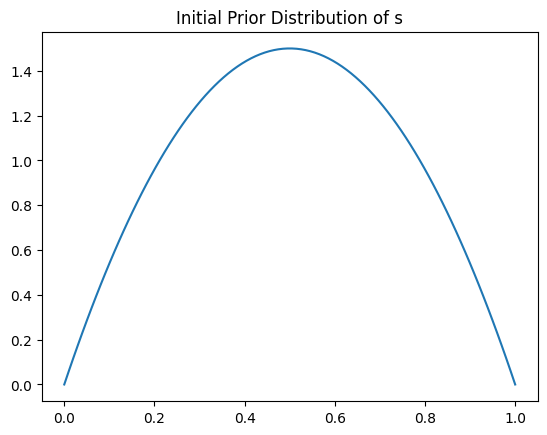

# Assignment 1-A Prior and Posterior Distributions

## Likelihood of s

Let $S$ be the random variable denoting the probability of a customer liking the new update. Given,
$$ S \sim Beta(\alpha, \beta) $$

Beta distribution is a conjugate prior for the Binomial likelihood. We are making an assumption that the likelihood function follows Binomial distribution.

Given a set of observations $\textbf{D} = \{D_1, D_2, \ldots, D_n\}$, likelihood function is given by

$$ 
P(\textbf{D}|s) = \prod_{i=1}^{n} P(D_i|s)
       = \prod_{i=1}^{n} s^{D_i}(1-s)^{1-D_i}
       = s^{l}(1-s)^{m}
$$

where $l$ is the number of successes (customer likes the update) and $m$ is the number of failures (customer does not like the update) in $\textbf{D}$.

## Posterior of s

From Bayes Theorem,

$$ P(s|\textbf{D}) = \frac{P(\textbf{D}|s)P(s)}{P(\textbf{D})} $$

$P(\textbf{D})$ is a normalization constant, it can be expressed as

$$ P(\textbf{D}) = \int P(\textbf{D}|s)P(s)ds $$

$\therefore$ $P(s|\textbf{D})$ $\propto$ $P(\textbf{D}|s)P(s)$

In words, posterior $\propto$ likelihood $\times$ prior.

Since
$$ P(\textbf{D}|s) = s^{l}(1-s)^{m} $$
$$ P(s) = \frac{\Gamma(\alpha + \beta)}{\Gamma(\alpha)\Gamma(\beta)}s^{\alpha-1}(1-s)^{\beta-1} $$

$$ P(s|\textbf{D}) \propto s^{\alpha + l - 1}(1 - s)^{\beta + m - 1} $$

Normalizing, we get

$$ P(s|\textbf{D}) = \frac{s^{\alpha + l - 1}(1 - s)^{\beta + m - 1}}{\int{s^{\alpha + l - 1}(1 - s)^{\beta + m - 1}}} $$
$$ P(s|\textbf{D}) = \frac{\Gamma(\alpha + l + \beta + m)}{\Gamma(\alpha + l)\Gamma(\beta + m)}s^{\alpha + l - 1}(1 - s)^{\beta + m - 1} $$
$$ P(s|\textbf{D}) = Beta(s; \alpha + l, \beta + m) $$

We are given that the probability of a customer liking the new update of a software, $s$, follows a beta distribution with parameters ($\alpha$, $\beta$) = (2, 2). This will be our first prior distrubution.

Now, we are given that 50 customers were surveyed, and 40 of them liked the update. So, we now combine this survey data with out prior distribution data to obtain the posterior distribution of s.

We know that given a beta distribution with parameters $\alpha$ and $\beta$, and in the set of observations $D$, $l$ observations of one type and $m$ observations of another type, the posterior distribution of a random variable $s$ is given by

$$P(s/\textbf{D}) = Beta(s; \alpha + l, \beta + m)$$

It is then told that another survey was conducted in which 30 customers were surveyed, and 17 of them liked the update. Now, to find the posterior distribution after this second survey, we consider the previously calculated posterior distribution after the first survey as our prior distribution. This is done because the first survey conducted becomes part of the prior data that we hold, and we want to improvise our model based on the previously available data.

It is then told that another survey was conducted in which 100 customers were surveyed, and 70 of them liked the update. Again, to find the posterior distribution after this third survey, we consider the previously calculated posterior distribution after the second survey as our prior distribution.

Now all the likelihoods are plotted together for a comparison among them.

