# Assignment 1-B

We have to fit various regression models to a dataset containing 546 samples, where the $n$-th sample is of the form:

$$ (x_{n_1}, x_{n_2}, y_{n}) $$

where $(x_{n_1}, x_{n_2})$ are the features and $y_{n}$ is the target value.

We create a 80-20 split of the dataset for training and testing respectively.

### Structure of matrices

Our feature matrix is stored as:

$$ X = \begin{pmatrix}
x_{1_1} & x_{2_1} & \ldots & x_{N_1}\\
x_{1_2} & x_{2_2} & \ldots & x_{N_2}
\end{pmatrix}_{2 \times N} $$

and the target vector is stored as:

$$ Y = \begin{pmatrix}
y_{1} & y_{2} & \ldots & y_{N}
\end{pmatrix}_{1 \times N}  $$

# POLYNOMIAL REGRESSION

### Our model

$$ f_{\textbf{w}}(\textbf{x}_{i}) = \sum_{j=0}^{M} w_jx_{i_j} $$

where $x_{i_0} = 1$ for all training examples, $x_{i_1}$ and $x_{i_2}$ correspond to the features in dataset and the remaining $x_{i_j}$'s refer to higher degree terms found by multiplying $x_{i_1}$ and $x_{i_2}$.

### Normalization

We calculate the mean ($\mu$) and standard deviation ($\sigma$) of the training data. We normalize training data as:

$$ x_{i_j} = \frac{x_{i_j} - \mu_j}{\sigma_j} $$

We also store $\mu$ and $\sigma$ vectors to normalize the testing data using the same $\mu$ and $\sigma$.

### Generating Feature Matrix

We generate feature matrix for polynomial regression using nested for loops. We generate a matrix with all the polynomial features till degree 9, and later slice rows from this matrix to run polynomial regression for lower degrees.

Our generated feature matrix is as follows:

$$ \begin{pmatrix}
1 & 1 & \ldots & 1\\
x_{1_1} & x_{2_1} & \ldots & x_{N_1}\\
x_{1_2} & x_{2_2} & \ldots & x_{N_2}\\
(x_{1_1})^2 & (x_{2_1})^2 & \ldots & (x_{N_1})^2\\
(x_{1_1})(x_{1_2}) & (x_{1_2})(x_{2_2}) & \ldots & (x_{N_1})(x_{N_2})\\
(x_{1_2})^2 & (x_{2_2})^2 & \ldots & (x_{N_2})^2\\
\vdots & \vdots & & \vdots\\
(x_{1_2})^9 & (x_{2_2})^9 & \ldots & (x_{N_2})^9\\
\end{pmatrix} $$

### Cost Function

We calculate cost function for regression as follows:
$$ \begin{align*}
&J(\textbf{w}) = \frac{1}{2} \sum_{i=1}^N (y_{i} - f_{\textbf{w}}(\textbf{x}_{i}))^2 \\ \\
&J(\textbf{w}) = \frac{1}{2}\, (\textbf{Y} - \textbf{W}^{T}\,\textbf{X})\,(\textbf{Y} - \textbf{W}^{T}\,\textbf{X})^{T}
\end{align*}$$

### Error Function

The error function will be the $RMS$ of the difference between the predicted value and the given value
$$ \begin{align*}
&E(\textbf{w}) = \sqrt{\frac{1}{N} \, \sum_{i=1}^N \, (y_{i} - f_{\textbf{w}}(\textbf{x}_{i}))^2} \\ \\
&E(\textbf{w}) = \sqrt{\frac{1}{N} \, (\textbf{Y} - \textbf{W}^{T}\,\textbf{X})\,(\textbf{Y} - \textbf{W}^{T}\,\textbf{X})^{T}}
\end{align*}$$

### Gradient Descent

We implement gradient descent by updating the weights for a fixed number of iterations:

$$ w_j = w_j - \alpha\frac{\partial J(\textbf{w})}{\partial w_j} $$

where $\alpha$ is the learning rate, and

$$ \frac{\partial J(\textbf{w})}{\partial w_j} = \sum_{i=1}^{N} (y_i - f_{\textbf{w}}(\textbf{x}_{i}))(-x_{i_j}) $$

Which in matrix form will be

$$ \begin{align*}

% &{\textbf{w}} = {\textbf{w}} - \alpha\frac{\partial J(\textbf{w})}{\partial \textbf{w}} \\ \\
&{\textbf{w}} = {\textbf{w}} - \alpha\,\,\frac{\mathrm{d}}{\mathrm{d} \textbf{w}} J(\textbf{w})\\ \\

&{\textbf{w}} = {\textbf{w}} - {\alpha} \, (-\textbf{X}) \, ({\textbf{Y} - \textbf{w}^{T}\,\textbf{X}})^{T}

\end{align*}$$

### Stochastic Gradient Descent

We implement stochastic gradient descent similarly, the cost and its gradient is calculated with respect to a randomly chosed sample (instead of all samples) on every iteration.

$$ w_j = w_j - \alpha\,\frac{\partial J_{SGD}(\textbf{w})}{\partial w_j} $$

Cost function for SGD:

$$\begin{align*}

&J_{SGD}(\textbf{w}) = \frac{1}{2} (y_{i} - f_{\textbf{w}}(\textbf{x}_{i}))^2 \\ \\

&J_{SGD}(\textbf{w}) = \frac{1}{2} (y_{i} - \textbf{w}^{T}\,\textbf{x}_{i})\,(y_{i} - \textbf{w}^{T}\,\textbf{x}_{i})^{T}

\end{align*}$$

Gradient of cost function for SGD:

$$ \frac{\partial J_{SGD}(\textbf{w})}{\partial w_j} = (y_{i} - f_{\textbf{w}}(\textbf{x}_{i}))(-x_{i_j}) $$

$$ \frac{\mathrm{d}}{\mathrm{d} \mathrm{w}} J_{SGD}(\textbf{w}) = (-\textbf{x}_{i})(y_{i} - \textbf{w}^{T}\,\textbf{x}_{i}) $$

Finally Stochastic Gradient Descent looks like -

$$ \textbf{w} = \textbf{w} - \alpha\,(-\textbf{x}_{i})(y_{i} - \textbf{w}^{T}\,\textbf{x}_{i}) $$

$i$ is chosen randomly from $(1, N)$ for every iteration.

### Regression

The $\,\,training\_polynomial\_regression()$ function takes three parameters $-$

$ Y $ $-$ The target attribute matrix

$ X $ $-$ The complete feature matrix

$ descent\_type $ $-$ Specifies wether gradient descent or stochastic gradient descent has to be performed    

The function, iterates through degrees $0$ to $9$ and finds the weights $(W)$ by performing the appropriate descent on the given data.

The errors through each iteration is stored in $cost\_desc$ which is then plotted. The final errors for each degree is stored in $error\_history$

The final weights for each degree is stored in $W\_history$ which is returned along with $error\_history$

##### Getting the feature matrix for degree $d$

The feature matrix passed to the function, contains features upto degree $9$. The feature matrix is created in such a way that the first ${d + 2 \choose 2}$ rows of $X$, give the feature matrix for degree $d$

### Testing

The funcion $testing\_polynomial\_regression()$ takes $3$ arguments $-$

$Y$ $-$ The target attribute for the testing data

$X$ $-$ The complete feature matrix of the testing data

$W$ $-$ A ${2}$-d array. The $i^{th}$ row of which stores the weights for degree $i$  

The final testing error of each degree is stored in $error\_history$ which is then returned by the function.

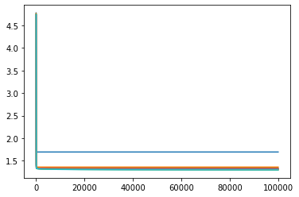
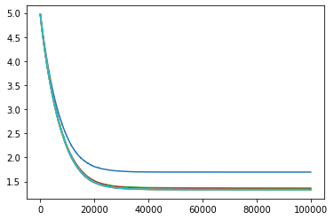
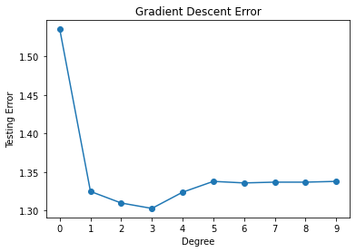
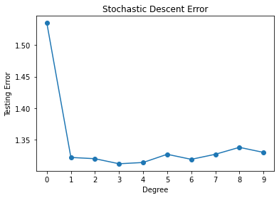

|Degree| Training Error (Gradient)| Training Error (Stochastic) |Testing Error (Gradient) |Testing Error (Stochastic)|
|---|---|---|---|---|
|0| 1.6944| 1.6944| 1.534838| 1.534624|
|1| 1.3606| 1.3608| 1.324867| 1.323926|
|2| 1.3325| 1.3570| 1.309989| 1.318076|
|3| 1.3269| 1.3370| 1.303107| 1.309406|
|4| 1.3187| 1.3306| 1.323781| 1.316062|
|5| 1.3101| 1.3302| 1.338475| 1.325186|
|6| 1.3055| 1.3295| 1.336455| 1.323378|
|7| 1.3022| 1.3291| 1.337395| 1.330144|
|8| 1.2991| 1.3280| 1.337464| 1.334542|
|9| 1.2970| 1.3271| 1.338169| 1.335491|

Since the testing error is the least for degree 3, we can conclude that polynomial regression of degree 3 best fits the given dataset.

# REGULARIZATION

### Regularized Cost Function

We calculate cost function for regularized linear regression as follows:

$$ J_{reg}(\textbf{w}) = \frac{1}{2} \sum_{i=1}^N (y_{i} - f_{\textbf{w}}(\textbf{x}_{i}))^2 + \frac{\lambda}{2} \sum_{j=1}^M |w_j|^q $$

$$ J_{reg}(\textbf{w}) = \frac{1}{2} (Y - W^TX) (Y - W^TX)^T + \frac{\lambda}{2} \sum_{j=1}^M |w_j|^q $$

The bias, $w_0$ is not regularized.

### Regularized Linear Regression

We implement regularized linear regression by updating the weights for a fixed number of iterations:

$$ w_j = w_j - \alpha\frac{\partial J_{reg}(\textbf{w})}{\partial w_j} $$

where $\alpha$ is the learning rate, and

$$ \frac{\partial J_{reg}(\textbf{w})}{\partial w_j} = \sum_{i=1}^{N} (y_{i} - f_{\textbf{w}}(\textbf{x}_{i}))(-x_{i_j}) + \frac{\lambda}{2} q|w_j|^{q-1} \frac{w_j}{|w_j|}  $$

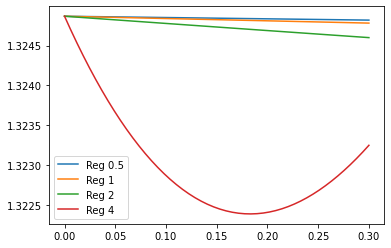

|Type| Training RMS| Testing RMS|
|---|---|---|
|Unregularized Linear| 1.360600| 1.324867|
|Unregularized Cubic| 1.326900| 1.303107|
|Regularized 0.5 |1.375088| 1.307830|
|Regularized 1 |1.375890| 1.308257|
|Regularized 2 |1.365160| 1.320221|
|Regularized 4 |1.362957| 1.322391|

##### Comparison between the best regularized and the best non-regularized model

Of all the regularized models, the one where q is 0.5 performs the best in testing data. Comparing this with the best performing non-regularized polynomial regression model (cubic regression) we can see that cubic regression performs better.

This can be explained as non-regularized linear regression does not overfit the training dataset hence adding regularization does not improve the performance of the model significantly.

# Surface plots of regression models

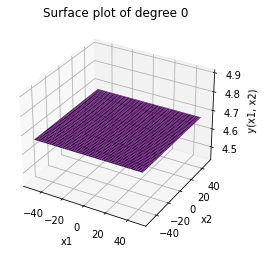
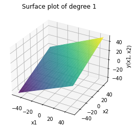
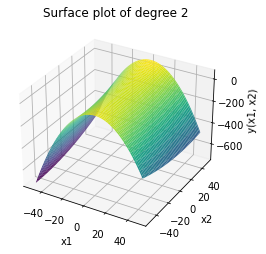
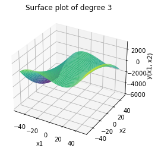
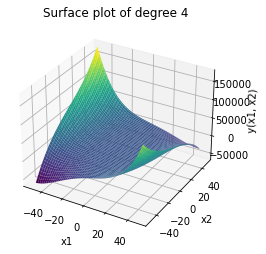
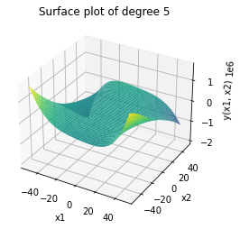
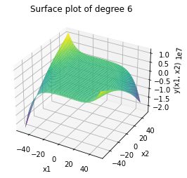
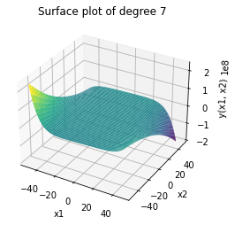
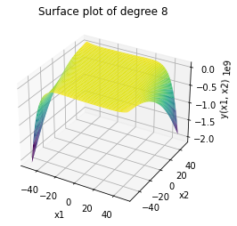
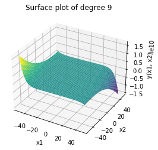