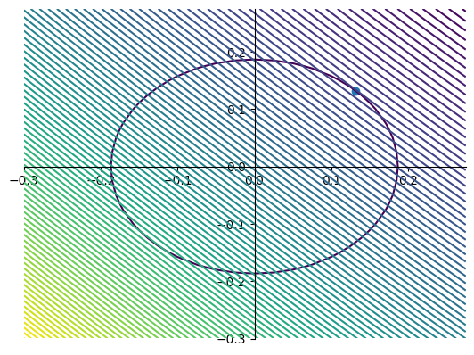

# 1C Report

We are given the optimization problem

$$minimize E(w) = \frac{1}{2} \sum_{i=1}^{N} (y_n - t_n)^2$$ 
$$subject \,\,to \,\,|w_1|^q + |w_2|^q \le \eta$$

where <br>
$y_n = w_1x_{n_1} + w_2x_{n_2}$ <br> $N$ is the total umber of samples, and <br>$x_{n_1}$ and $x_{n_2}$ represent the two features of the $n^{th}$ sample.
 
 <br> <br>

## Finding the error equation

<br>

The error function is as follows

$$\begin{align*}
&E(w) = \frac{1}{2}\sum_{n=1}^{N} (y_n - t_n)^2 \\ \\
&E(w) = \frac{1}{2}\sum_{n=1}^{N} (w_1x_{n_1} + w_2x_{n_2} - t_n)^2
 \end{align*}$$

 This expression, when expanded, will contain terms $w_1^2, w_2^2, w_1w_2, w_1, w_2$ and a constant term. The coefficients of these terms in the expansion are evaluated separately using matrix multiplications.

 Coefficient of $w_1^2$ is $0.5*\sum_{n=1}^{N}x_{1n}^2$
<br> <br>
 Coefficient of $w_2^2$ is $0.5*\sum_{n=1}^{N}x_{2n}^2$
<br> <br>
 Coefficient of $w_1w_2$ is $\sum_{n=1}^{N}x_{1n}\,x_{2n}$
<br> <br>
 Coefficient of $w_1$ is $-\sum_{n=1}^{N}t_n\,x_{1n}$
<br> <br>
 Coefficient of $w_2$ is $-\sum_{n=1}^{N}t_n\,x_{2n}$
<br> <br>
 The constant term is $0.5*\sum_{n=1}^{N}t_n^2$

 <br> <br>

## Error contour plot

Since the error function will be an implicit function (cannot be expressed purely in terms of $w_1$ and $w_2$), we need to determine a set of values for $w_1$ and $w_2$ for which we will be plotting the contours. This is done by choosing a start value, an end value and an increment for both $w_1$ and $w_2$. 

```
w1_range = np.arange(-5.0, 5.0, delta)
w2_range = np.arange(-5.0, 5.0, delta)
```

Then we align the axes such that the origin is at the center of the graph, and create the implicit equation of the cost function using the coefficients calculated previously, and then finally plot it using `plt.contour()`. The resulting contour looks like - <br> <br>


<br><br> <br>

## Plotting constraint regions, finding points of intersection with error function contour plots and generating mean squared errors.
<br>

We now plot the constraint equations by plugging in appropriate q and $\eta$ values in the constraint equations. Then we estimate the point of intersection where both the curves are tangential to each other. The $w_1$ and $w_2$ values at this point are used to generate our model. 

<br>

### Case #1: $|w_1|^{0.5} + |w_2|^{0.5} \le 1.4$

<br> <br>


<br>

Therefore, the model that we get through the intersection of the contour plots and the constraint equation is $y = 1.96\,x_2$. We then calculated the mean squared error which comes out to be $3.277$.

<br> <br>

### Case #2: $|w_1| + |w_2| \le 0.1$

<br>


<br>

Therefore, the model that we get through the intersection of the contour plots and the constraint equation is $y = 0.1\,x_1$. We then calculated the mean squared error which turns out to be $22.087$.

<br> <br>


### Case #3: $|w_1|^2 + |w_2|^2 \le 0.035$

<br>



<br>

Therefore, the model that we get through the intersection of the contour plots and the constraint equation is $y = 0.132\,x_1 + 0.132\,x_2$. We then calculate the mean squared error which turns out to be $18.4928$.

<br> <br>

### Case #4: $|w_1|^4 + |w_2|^4 \le 0.052$

<br>


<br>

Therefore, the model that we get through the intersection of the contour plots and the constraint equation is $y = 0.39\,x_1 + 0.41\,x_2$. We then calculated the mean squared error which turns out to be $9.32168$.

